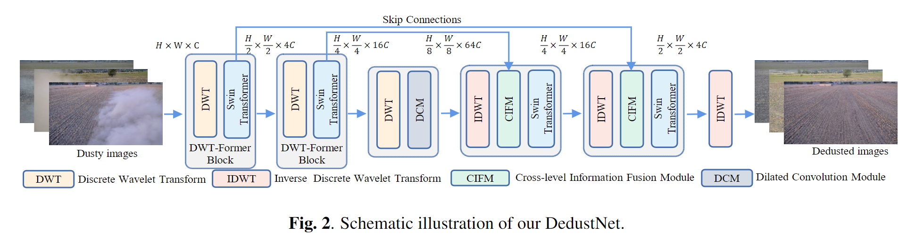
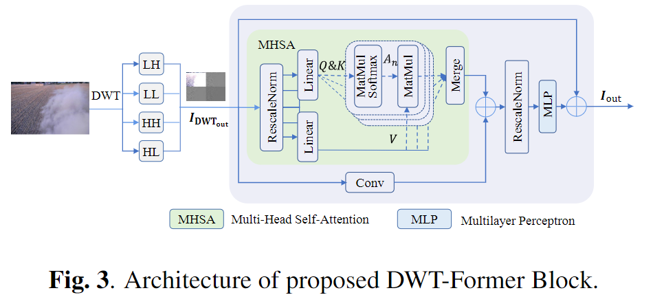
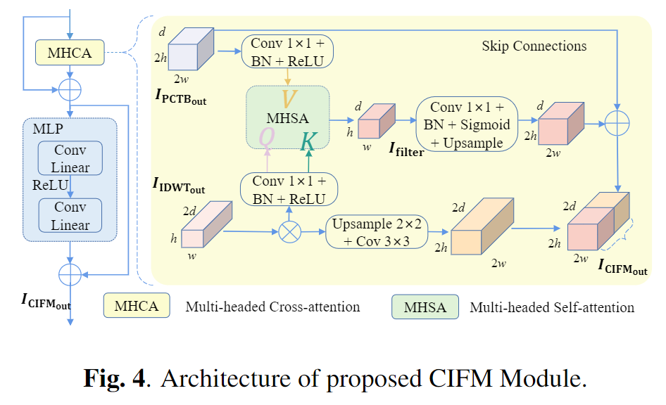
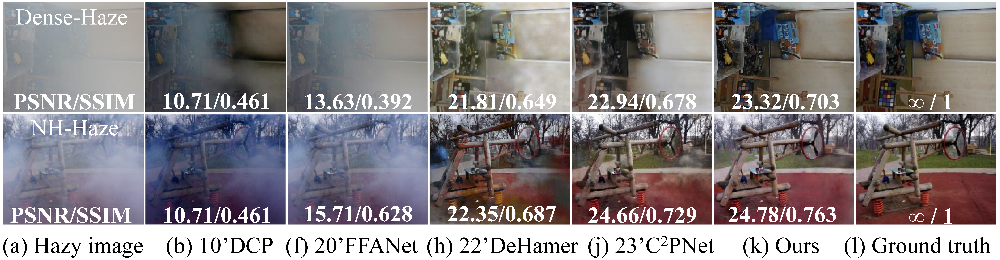
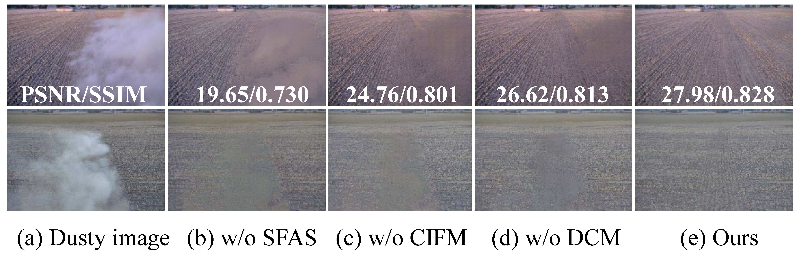

# DedustNet: A Frequency-dominated Swin Transformer-based network for Agricultural Dust Removal

This is the official PyTorch codes for the paper:

Zhiyong Tao, Shengli Zhang, Sen Lin (Corresponding author: Shengli Zhang  email@zhangshengli\_win@163.com)

>__Abstract:__ Dust has a significant impact on the environmental perception of automated agricultural machines, and dust removal methods using deep learning approaches still need to be further improved and refined. In this paper, a trainable end-to-end learning network (DedustNet) is specifically proposed to solve the real-world dust removal task. Specially, the frequency-dominated Swin Transformer-based block (DWT-Transformer Block) is proposed to address the limitation of the global receptive field and global information when facing complex dusty background. The Cross-level Information Fusion Module is presented to solve the loss of texture details and color brought by image enhancement algorithms to the processing results. DedustNet trades off the model complexity and the network's dust removal performance with 1.866M, both qualitative and quantitative results show that DedustNet outperforms state-of-the-art methods on reference and non-reference metrics.

* [Network Architecture](https://github.com/shengli666666/DedustNet#network-architecture)
* [Dependencies and Installation](https://github.com/shengli666666/DedustNet#Dependencies-and-Installation)
* [Datasets Preparation](https://github.com/shengli666666/DedustNet#Datasets-Preparation)
    * [Real world RB Dust Dataset ](https://github.com/shengli666666/DedustNet#Real-world-RB-Dust-Dataset)
    * [Real world Fog Dense Haze and NH Haze Datasets](https://github.com/shengli666666/DedustNet#Real-world-Fog-Dense-Haze-and-NH-Haze-Datasets)
* [Quick Run](https://github.com/shengli666666/DedustNet#Quick-Run)
* [Quantitative comparisons](https://github.com/shengli666666/DedustNet#Quantitative-comparisons)
    * [Comparison of objective indicators (PSNR, SSIM, NIQE, Entropy)](https://github.com/shengli666666/DedustNet#Comparison-of-objective-indicators-(PSNR,-SSIM,-NIQE,-Entropy))
    * [Comparison of Overhead (#Param, #FLOPs, #Runtime)](https://github.com/shengli666666/DedustNet#Comparison-of-Overhead-(#Param,-#FLOPs,-#Runtime))
* [Qualitative Comparisons](https://github.com/shengli666666/DedustNet#Qualitative-Comparisons)
    * [RB-Dust datasets](https://github.com/shengli666666/DedustNet#RB-Dust-datasets)
    * [Dense-Haze](https://github.com/shengli666666/DedustNet#Dense-Haze)
    * [NH-Haze](https://github.com/shengli666666/DedustNet#NH-Haze)  
* [Ablation Study](https://github.com/shengli666666/DedustNet#Ablation-Study)
* [Citation](https://github.com/shengli666666/DedustNet#Citation)
   
## Network Architecture

<center>
    
</center>

|||
|:-:|:-:|

## Dependencies and Installation

* python3.9
* PyTorch>=1.0
* NVIDIA GPU+CUDA
* numpy
* matplotlib
* pytorch_wavelets
## Datasets Preparation

### Real world Dust Dataset:

* Dataset: RB-Dust; Paper: [RB-Dust – A Reference-based Dataset for Vision-based Dust Removal](https://arxiv.org/pdf/2306.07244.pdf)(www.agriscapes-dataset.com)

### Real world Fog Datasets:

* Dataset: DENSE; Paper: [Dense-Haze: a benchmark for image dehazing with dense-haze and haze-free images](https://arxiv.org/pdf/1904.02904.pdf)
* Dataset: NHHAZE; Paper: [NTIRE 2020 NonHomogeneous Dehazing Challenge (2020)](https://competitions.codalab.org/competitions/22236) ; 
<details>
<summary> FILE STRUCTURE (click to expand) </summary>

```
    DedustNet
    |-- README.md
    |-- datasets
        |--RealWorld
            |-- dust
                |-- hazy
                    |-- *.png
                |-- clear
                    |-- *.png
            |-- dense
                |-- hazy
                    |-- *.png
                |-- clear
                    |-- *.png
            |-- nhhaze
                |-- hazy
                    |-- *.png
                |-- clear
                    |-- *.png
```
</details>

## Quick Run

Trained_models are available at [google drive]() .

*Put  models in the `./trained_models/` folder.*

To test the pre-trained models of Dust, Dense-Haze, and NHHaze on your own images, run:
```shell
python test.py --task Task_Name --input_dir path_to_images
```
Here is an example to perform Dust:

```shell
python test.py --task dust --input_dir dataset/dusttest/hazy
```
We have included some test images from the experimental results presented in our paper at `./image file/` folder. 
* `overhead.py` is a file where you can test network model's parameters (Params), multiply-accumulate operations (MACs), floating-point operations (FLOPs) and inference time.

## Quantitative comparisons

Quantitative comparisons on computational efficiency among DedustNet and SOTA methods, where the floating-point operations and inference time are measured on RGB image with a resolution of 256 × 256.

<center>
    
</center>

Our method does not have a great advantage in inference time compared to SOTA methods, which is because three DWT and IDWT are used in our network, the process of wavelet transform takes a certain amount of time. However, our method outperforms the SOTS methods in quantitative evaluation metrics (PSNR, SSIM, Entropy, and NIQE) and qualitative comparisons on the RB-Dust dataset. Therefore, our proposed method has a great advantage in a comprehensive view of the number of network parameters, model complexity, and overall network performance.

## Qualitative comparisons

### RB-Dust datasets

<center>
    
</center>

||||
|:-:|:-:|:-:|

To verify the robustness and effectiveness of DedustNet, we have done extension experiments in fog removal, and as can be seen in Fig.6, DedustNet also achieves satisfactory results in fog removal compared to SOTA methods, demonstrating the robustness and generalization ability of DedustNet.

<center>
    
</center>

#### Dense-Haze

||||
|:-:|:-:|:-:|


#### NH-Haze

||||
|:-:|:-:|:-:|

## Ablation Study

<center>
    
</center>

## Citation

Thank you very much for your valuable suggestions for our work, if you have other questions, very much look forward to your contact with us, Corresponding author's email： zhangshengli_win@163.com, your comments will make our work better!
