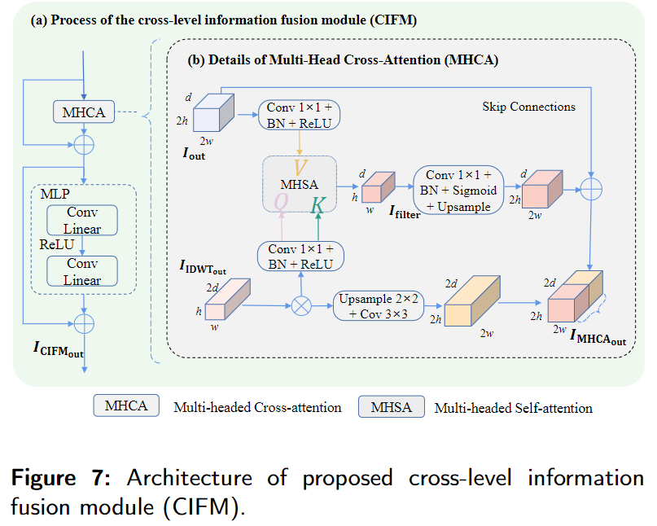
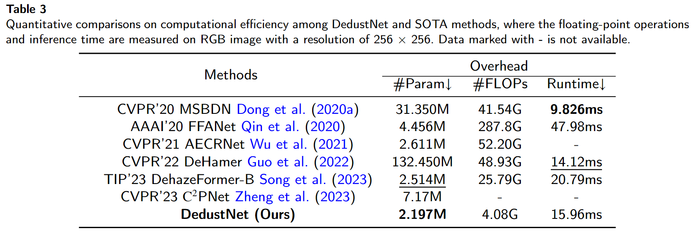
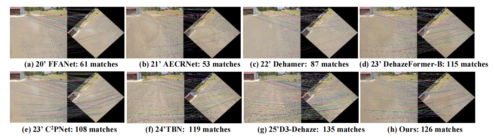

# DedustNet: A Frequency-dominated Swin Transformer-based network for Agricultural Dust Removal

Author Information:

Shengli Zhang, Zhiyong Tao, and Sen Lin (Corresponding author: Zhiyong Tao; First author: Shengli Zhang email@zhangshengli\_win@163.com)

>__Abstract:__ While dust significantly affects the environmental perception of automated agricultural machines, it still needs to be explored, and the existing deep learning-based methods for dust removal require further refinement and development. Further research and improvement in this area are essential to improve the performance and reliability of automated agricultural machines in dusty environments. As a solution, we propose an end-to-end trainable learning network (DedustNet) to solve the real-world agricultural dust removal task. To our knowledge, DedustNet is the first time Swin Transformer-based units have been used in wavelet networks for agricultural image dusting. Specifically, we present the frequency-dominated Swin Transformer-based block (DWTFormer block and IDWTFormer block) with the wavelet transform. As the basic blocks of the encoding and decoding, the DWTFormer block and IDWTFormer block recover richer details, such as the structure and texture of the image, alleviating the limitation of the global receptive field of Swin Transformer when dealing with complex dusty backgrounds.

>Furthermore, We propose a cross-level information fusion module (CIFM) to fuse different levels of features and effectively capture global and long-range feature relationships. In addition, we present a dilated convolution module (DCM) to capture contextual information guided by wavelet transform at multiple scales, which combines the advantages of wavelet transform and dilated convolution. Our algorithm leverages deep learning techniques to effectively remove dust from images captured in real-world agricultural settings while preserving the original structural and textural features. Compared to existing state-of-the-art methods, DedustNet achieves superior performance and more reliable results in agricultural image dedusting, providing strong support for the application of agricultural machinery in dusty environments. Additionally, the impressive performance on real-world hazy datasets and application tests highlights DedustNet's superior generalization ability and computer vision-related application performance compared to state-of-the-art methods.

* [Network Architecture](https://github.com/shengli666666/DedustNet#network-architecture)
* [Dependencies and Installation](https://github.com/shengli666666/DedustNet#Dependencies-and-Installation)
* [Datasets Preparation](https://github.com/shengli666666/DedustNet#Datasets-Preparation)
    * [Real world Dust Dataset ](https://github.com/shengli666666/DedustNet#Real-world-Dust-Dataset)
    * [Real world Fog Datasets](https://github.com/shengli666666/DedustNet#Real-world-Fog-Datasets)
* [Quick Run](https://github.com/shengli666666/DedustNet#Quick-Run)
* [Quantitative comparisons](https://github.com/shengli666666/DedustNet#Quantitative-comparisons)
    * [Comparison of objective indicators](https://github.com/shengli666666/DedustNet#Comparison-of-objective-indicators)
    * [Comparison of Overhead](https://github.com/shengli666666/DedustNet#Comparison-of-Overhead)
* [Qualitative Comparisons](https://github.com/shengli666666/DedustNet#Qualitative-Comparisons)
    * [RB-Dust datasets](https://github.com/shengli666666/DedustNet#RB-Dust-datasets)
    * [Real world hazy datasets](https://github.com/shengli666666/DedustNet#Real-world-hazy-datasets)
* [Application test](https://github.com/shengli666666/DedustNet#application-test
)
    * [Keypoint matching detection](https://github.com/shengli666666/DedustNet#keypoint-matching-detection
)
    * [Image edge extraction](https://github.com/shengli666666/DedustNet#image-edge-extraction
)
* [Ablation Study](https://github.com/shengli666666/DedustNet#Ablation-Study)
* [Citation](https://github.com/shengli666666/DedustNet#Citation)
   
## Network Architecture

As we have uploaded a lot of pictures, the page may refresh slowly. Thank you very much for your patience!

### DedustNet Network

<center>
    
</center>

DedustNet consists of two encoding and decoding processes. The encoding and decoding of DedustNet are based on the DWTFormer and IDWTFormer blocks. Although the DWT-Former block as the base block of the network mainly combines wavelet transform and Swin Transformer, we do not directly apply these existing tools but improve them. We use the wavelet transform to transform the features to the frequency domain and use the frequency information to guide DedustNet to recover the structural and texture details of the image. 

Furthermore, we combine a cross-level information fusion module (CIFM) to integrate information from two different encoding and decoding stages, which can effectively capture global self-similarity and long-range feature relationships. To connect encoding and decoding, we propose the dilated convolution module (DCM) that serves as an interface between the two stages to complete the feature interaction in different receptive fields.

### DWT-Former Block and CIFM Moudle

<center>
    
</center>

|||
|:-:|:-:|

## Dependencies and Installation

* python3.9
* PyTorch>=1.0.1
* NVIDIA GPU+CUDA>=11.4
* numpy
* matplotlib
* pytorch_wavelets
## Datasets Preparation

### Real world Dust Dataset:

* Dataset: RB-Dust; Paper: [RB-Dust – A Reference-based Dataset for Vision-based Dust Removal](https://arxiv.org/pdf/2306.07244.pdf)(www.agriscapes-dataset.com)

### Real world Fog Datasets:

* Dataset: Dense-Haze; Paper: [Dense-Haze: a benchmark for image dehazing with dense-haze and haze-free images](https://arxiv.org/pdf/1904.02904.pdf)
* Dataset: NH-HAZE; Paper: [NTIRE 2020 NonHomogeneous Dehazing Challenge (2020)](https://competitions.codalab.org/competitions/22236)
* Dataset: I-HAZE; Paper: [I-HAZE: a dehazing benchmark with real hazy and haze-free indoor images](https://arxiv.org/pdf/1804.05091.pdf)
* Dataset: O-HAZE; Paper: [O-HAZE: a dehazing benchmark with real hazy and haze-free outdoor images](https://openaccess.thecvf.com/content_cvpr_2018_workshops/papers/w13/Ancuti_O-HAZE_A_Dehazing_CVPR_2018_paper.pdf)
* Dataset: Natural hazy images dataset; Paper: [Dehazing Using Color-Lines](https://www.cs.huji.ac.il/w~raananf/projects/dehaze_cl/results/#stadium)
<details>
<summary> FILE STRUCTURE (click to expand) </summary>

```
    DedustNet
    |-- README.md
    |-- datasets
      |-- dust
          |-- dusty
              |-- *.png
          |-- clear
              |-- *.png
      |-- dense
          |-- hazy
              |-- *.png
          |-- clear
              |-- *.png
      |-- nhhaze
          |-- hazy
              |-- *.png
          |-- clear
              |-- *.png
```
</details>

## Quick Run

Before you start your experiment, please follow the [instructions](https://www.cnblogs.com/wanghui-garcia/p/12526298.html) to install pytorch-wavelets.

Trained_models are available at [google drive](https://drive.google.com/drive/folders/1g6X7wYV_yILRqYx7GoUuhW4CSJXiPnCZ?hl=zh-cn) .

For your quick run, we have selected a small number of dusty images in the `./datasets/dusty` folder

*Put  models in the `./trained_models/` folder.*

To test the pre-trained models of Dust, Dense-Haze, and NHHaze on your own images, run:
```shell
python test.py --task Task_Name --input_dir path_to_images
```
Here is an example to perform Dust:

```shell
python test.py --task dust --input_dir dataset/dusty
```
*Check out the test results in the `./dedustresult` folder.*

We will publish the training code after confirmation of acceptance. Thank you for your understanding!

## Quantitative comparisons

We have uploaded the MATLAB versions of the three reference-free indicators (**`NIQE.m`**, **`Entropy.m`**, and **`FADE.m`**) used in our papaer at `./metrics/` folder.

A higher Entropy score indicates that the image presents more detail; a lower NIQE score indicates better image quality.

### Comparison of objective indicators

<center>
    
</center>

### Comparison of Overhead

Quantitative comparisons on computational efficiency among DedustNet and SOTA methods, where the floating-point operations and inference time are measured on an RGB image with a resolution of 256 × 256

<center>
    
</center>

Our method does not have a great advantage in inference time compared to SOTA methods, which is because when three DWT and IDWT are used in our network, the process of wavelet transform takes a certain amount of time. However, our method outperforms the SOTS methods in quantitative evaluation metrics (PSNR, SSIM, Entropy, and NIQE) and qualitative comparisons on the RB-Dust dataset. Therefore, our proposed method has a great advantage in terms of a comprehensive view of the number of network parameters, model complexity, and overall network performance.

## Qualitative comparisons

__The uploaded images are high quality and slow to refresh, thank you very much for your patience!__

### RB-Dust datasets

<center>
    
</center>

||||
|:-:|:-:|:-:|

### Real world hazy datasets

To verify the robustness and effectiveness of DedustNet, we have done extension experiments in fog removal, and as can be seen in Fig.6, DedustNet also achieves satisfactory results in fog removal compared to SOTA methods, demonstrating the robustness and generalization ability of DedustNet.

<center>
    
</center>

## Application test

To more fully validate the potential performance of our method on other vision tasks, we performed keypoint matching detection and image edge detection.

### Keypoint matching detection

<center>
    
</center>

### Image edge extraction

<center>
    
</center>

## Ablation Study

<center>
    
</center>

<center>
    
</center>

## Citation

Thank you very much for your valuable suggestions for our work, if you have other questions, very much look forward to your contact with us, Corresponding author's email： zhangshengli_win@163.com, your comments will make our work better!
