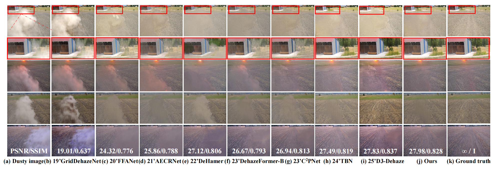
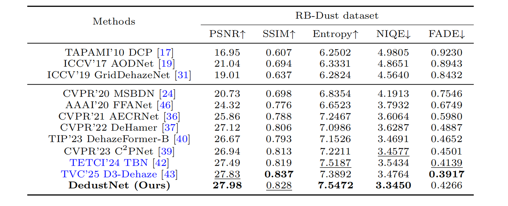
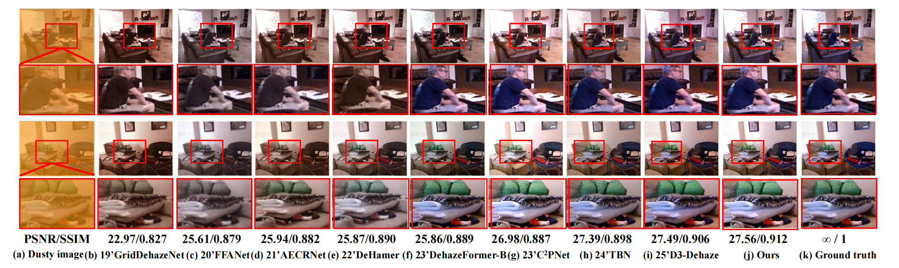
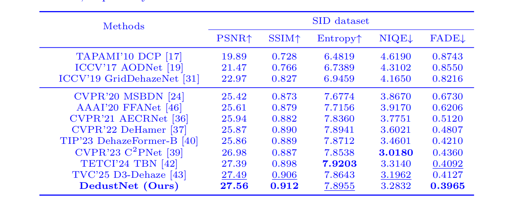
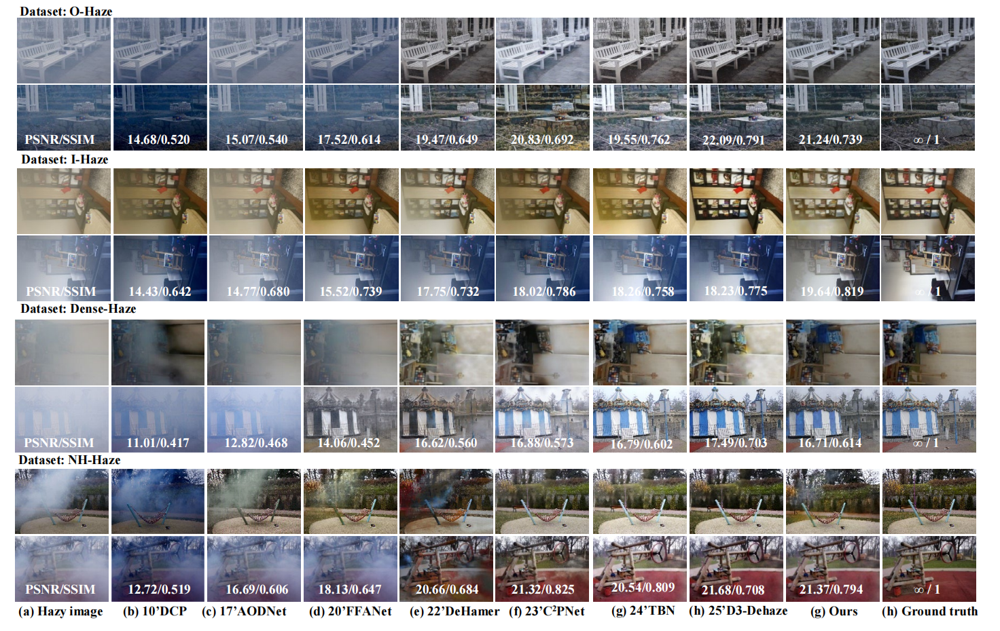
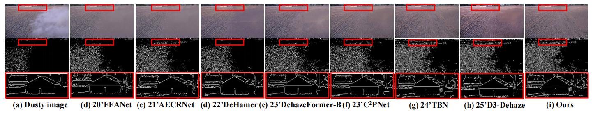
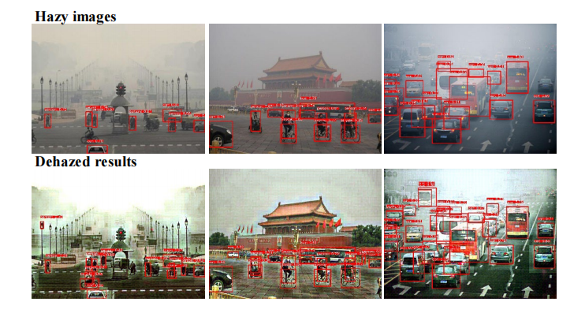
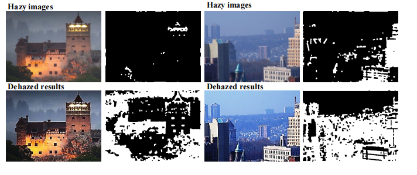

# DedustNet: A Frequency-dominated Swin Transformer-based network for Agricultural Dust Removal

Author Information:

Shengli Zhang, Zhiyong Tao, and Sen Lin (Corresponding author: Zhiyong Tao; First author: Shengli Zhang email@zhangshengli\_win@163.com)

>__Abstract:__ Dust has an adverse effect on the environmental sensors of automated agricultural machinery. This issue highlights the need for further investigation. Refining existing deep learning methods for dust removal is critical for improving the performance and reliability of these machines in dusty environments. We propose an end-to-end trainable learning network (DedustNet) to address the challenge of agricultural dust removal in real-world scenarios. To our knowledge, DedustNet represents the first application of Swin Transformer-based units in wavelet networks for agricultural image dusting. 

>DedustNet leverages frequency-dominated Swin Transformer-based blocks, namely, DWTFormer and IDWTFormer, in tandem with wavelet transforms. Acting as fundamental encoding and decoding units, these blocks enable the retrieval of intricate details, such as image structural and textural components. This approach effectively overcomes the limitations of the global receptive field in Swin Transformer under complex, dusty backgrounds. In addition, DedustNet incorporates a cross-level information fusion module (CIFM). This module adeptly integrates features from different levels, thereby facilitating the capture of global and long-range feature relationships. Moreover, DedustNet is enhanced by a dilated convolution module (DCM). This module leverages the guidance of wavelet transforms to extract contextual information at multiple scales.
Compared with those of existing state-of-the-art methods, DedustNet achieves superior performance and more reliable results in agricultural image dedusting, validating the powerful application of applied intelligence in agriculture. Additionally, the impressive performance on real-world hazy datasets and application tests highlights DedustNet's superior generalizability and computer vision-related application performance.

* [Network Architecture](https://github.com/shengli666666/DedustNet#network-architecture)
* [Dependencies and Installation](https://github.com/shengli666666/DedustNet#Dependencies-and-Installation)
* [Datasets Preparation](https://github.com/shengli666666/DedustNet#Datasets-Preparation)
    * [Synthetic Dust Dataset ](https://github.com/shengli666666/DedustNet#Synthetic-Dust-Dataset)
    * [Real world Dust Dataset ](https://github.com/shengli666666/DedustNet#Real-world-Dust-Dataset)
    * [Real world Fog Datasets](https://github.com/shengli666666/DedustNet#Real-world-Fog-Datasets)
* [Quick Run](https://github.com/shengli666666/DedustNet#Quick-Run)
* [Quantitative and Qualitative Comparisons](https://github.com/shengli666666/DedustNet/blob/main/README.md#quantitative-and-qualitative-comparisons)
    * [RB-Dust dataset](https://github.com/shengli666666/DedustNet#RB-Dust-dataset)
    * [SID dataset](https://github.com/shengli666666/DedustNet#SID-dataset)
    * [Real world hazy datasets](https://github.com/shengli666666/DedustNet#Real-world-hazy-datasets)
* [Application test](https://github.com/shengli666666/DedustNet?tab=readme-ov-file#application-test)
* [Citation](https://github.com/shengli666666/DedustNet#Citation)
   
## Network Architecture

As we have uploaded a lot of pictures, the page may refresh slowly. Thank you very much for your patience!

### DedustNet Network

<center>
    
</center>

DedustNet consists of two encoding and decoding processes. The encoding and decoding of DedustNet are based on the DWTFormer and IDWTFormer blocks. Although the DWT-Former block as the base block of the network mainly combines wavelet transform and Swin Transformer, we do not directly apply these existing tools but improve them. We use the wavelet transform to transform the features to the frequency domain and use the frequency information to guide DedustNet to recover the structural and texture details of the image. 

Furthermore, we combine a cross-level information fusion module (CIFM) to integrate information from two different encoding and decoding stages, which can effectively capture global self-similarity and long-range feature relationships. To connect encoding and decoding, we propose the dilated convolution module (DCM) that serves as an interface between the two stages to complete the feature interaction in different receptive fields.

### DWT-Former Block and CIFM Moudle

<center>
    
</center>

|||
|:-:|:-:|

## Dependencies and Installation

* python3.9
* PyTorch>=1.0.1
* NVIDIA GPU+CUDA>=11.4
* numpy
* matplotlib
* pytorch_wavelets
## Datasets Preparation

### Synthetic Dust Dataset:

* Dataset: SID; Paper: [SIDNet: A single image dedusting network with color cast correction](https://www.researchgate.net/publication/360520126_SIDNet_A_Single_Image_Dedusting_Network_with_Color_Cast_Correction)

### Real world Dust Dataset:

* Dataset: RB-Dust; Paper: [RB-Dust – A Reference-based Dataset for Vision-based Dust Removal](https://arxiv.org/pdf/2306.07244.pdf)(www.agriscapes-dataset.com)

### Real world Fog Datasets:

* Dataset: Dense-Haze; Paper: [Dense-Haze: a benchmark for image dehazing with dense-haze and haze-free images](https://arxiv.org/pdf/1904.02904.pdf)
* Dataset: NH-HAZE; Paper: [NTIRE 2020 NonHomogeneous Dehazing Challenge (2020)](https://competitions.codalab.org/competitions/22236)
* Dataset: I-HAZE; Paper: [I-HAZE: a dehazing benchmark with real hazy and haze-free indoor images](https://arxiv.org/pdf/1804.05091.pdf)
* Dataset: O-HAZE; Paper: [O-HAZE: a dehazing benchmark with real hazy and haze-free outdoor images](https://openaccess.thecvf.com/content_cvpr_2018_workshops/papers/w13/Ancuti_O-HAZE_A_Dehazing_CVPR_2018_paper.pdf)
* Dataset: Natural hazy images dataset; Paper: [Dehazing Using Color-Lines](https://www.cs.huji.ac.il/w~raananf/projects/dehaze_cl/results/#stadium)
<details>
<summary> FILE STRUCTURE (click to expand) </summary>

```
    DedustNet
    |-- README.md
    |-- datasets
      |-- dust
          |-- dusty
              |-- *.png
          |-- clear
              |-- *.png
      |-- dense
          |-- hazy
              |-- *.png
          |-- clear
              |-- *.png
      |-- nhhaze
          |-- hazy
              |-- *.png
          |-- clear
              |-- *.png
```
</details>

## Quick Run

Before you start your experiment, please follow the [instructions](https://www.cnblogs.com/wanghui-garcia/p/12526298.html) to install pytorch-wavelets.

Trained_models are available at [google drive](https://drive.google.com/drive/folders/1g6X7wYV_yILRqYx7GoUuhW4CSJXiPnCZ?hl=zh-cn) .

For your quick run, we have selected a small number of dusty images in the `./datasets/dusty` folder

*Put  models in the `./trained_models/` folder.*

we have train our model on two datasets: RB-Dust dataset and SID dataset, please see the link in ReadMe file to find the google drive link to download them, link is here [trained_model.pk](https://drive.google.com/drive/folders/1g6X7wYV_yILRqYx7GoUuhW4CSJXiPnCZ?usp=sharing)

To test the pre-trained models of Dust, Dense-Haze, and NHHaze on your own images, run:
```shell
python test.py --task Task_Name --input_dir path_to_images
```
Here is an example to perform Dust:

```shell
python test.py --task dust --input_dir dataset/dusty
```
*Check out the test results in the `./dedustresult` folder.*

We will publish the training code after confirmation of acceptance. Thank you for your understanding!

We have uploaded the MATLAB versions of the three reference-free indicators (**`NIQE.m`**, **`Entropy.m`**, and **`FADE.m`**) used in our papaer at `./metrics/` folder.

## Quantitative and Qualitative Comparisons

__The uploaded images are high quality and slow to refresh, thank you very much for your patience!__

### RB-Dust dataset

<center>
    
</center>

<center>
    
</center>

### SID dataset

<center>
    
</center>

<center>
    
</center>

||||
|:-:|:-:|:-:|

### Real world hazy datasets

To verify the robustness and effectiveness of DedustNet, we have done extension experiments in fog removal, and as can be seen in Fig.6, DedustNet also achieves satisfactory results in fog removal compared to SOTA methods, demonstrating the robustness and generalization ability of DedustNet.

<center>
    
</center>

## Application test

To more fully validate the potential performance of our method on other vision tasks, we performed keypoint matching detection, image edge detection, object detection, and salient object detection.

### Keypoint matching detection

<center>
    
</center>

### Image edge extraction

<center>
    
</center>

### Object detection (YOLOv8 detection algorithm)

<center>
    
</center>

### Salient object detection (PoolNet+ algorithm)

<center>
    
</center>

## Citation

Thank you very much for your valuable suggestions for our work, if you have other questions, very much look forward to your contact with us, Corresponding author's email： zhangshengli_win@163.com, your comments will make our work better!
